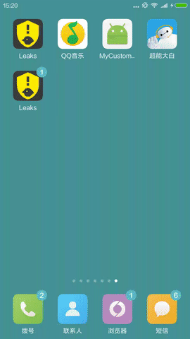
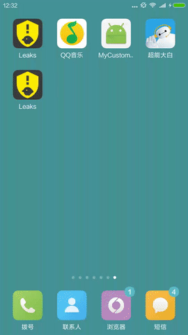

## MySnackBar
从顶部弹出的Snackbar,基于google SnackBar的控件，SnackBar所具有的属性他都具有，用于提示用户操作信息.
并且提供默认三种信息: SUCCESS,WARNING,ERROR

### Introduction
适用于actionBar、toolBar、或者自己定义的布局(你只需要把需要的高度传入即可)

## ScreenShot
4.4之上<br>


<br>4.4以下<br>
```
4.4以下比较特殊没有覆盖到状态栏，只能覆盖actionBar，正在想办法
```

## Gradle Config
 first add dependences
```
  dependencies {
    compile 'com.trycatch.android:mysnackbar:1.2.2'
  }
```

## use
```
    @Override
    protected void onCreate(Bundle savedInstanceState) {
        super.onCreate(savedInstanceState);
        if (android.os.Build.VERSION.SDK_INT >= Build.VERSION_CODES.KITKAT && android.os.Build.VERSION.SDK_INT<=Build.VERSION_CODES.LOLLIPOP) {
            Window window = getWindow();
            window.setFlags(WindowManager.LayoutParams.FLAG_TRANSLUCENT_STATUS, WindowManager.LayoutParams.FLAG_TRANSLUCENT_STATUS);
        }
    }
    final ViewGroup viewGroup = (ViewGroup) findViewById(android.R.id.content).getRootView();//注意getRootView()最为重要，直接关系到TSnackBar的位置
    snackBar.setPromptThemBackground(Prompt.SUCCESS).setText("登录成功").setDuration(TSnackbar.LENGTH_LONG).show();
    snackBar.setPromptThemBackground(Prompt.ERROR).setText("登录失败").setDuration(TSnackbar.LENGTH_LONG).show();
    TSnackbar.make(viewGroup, "网络已连接", TSnackbar.LENGTH_LONG, TSnackbar.APPEAR_FROM_TOP_TO_DOWN).setPromptThemBackground(Prompt.SUCCESS).show();
    TSnackbar.make(viewGroup, "网络未连接", TSnackbar.LENGTH_LONG, TSnackbar.APPEAR_FROM_TOP_TO_DOWN).setPromptThemBackground(Prompt.WARNING).show();
    TSnackbar snackBar = TSnackbar.make(viewGroup, "正在加载中...", TSnackbar.LENGTH_INDEFINITE, TSnackbar.APPEAR_FROM_TOP_TO_DOWN);
    snackBar.setAction("取消", new View.OnClickListener() {
        @Override
        public void onClick(View v) {

        }
    });
    snackBar.setPromptThemBackground(Prompt.SUCCESS);
    snackBar.addIconProgressLoading(0,true,false);
    snackBar.show();
```
## Instructions

* 自定义属性介绍（此控件是基于google SnackBar基础上实现的，因此SnackBar所具有的属性，他都有，下面给出一些我自己用到的属性）

name | 说明
-----|------
setMinHeight(int stateBarHeight,int actionBarHeight)| 状态栏高度，actionBar高度
addIcon(int resource_id)        |     图片资源
addIcon(int resource_id, int width, int height)    |图片资源以及大小
addIconProgressLoading(int resource_id,boolean left,boolean right)   | 加载动画样式
addIconProgressLoading(Drawable drawable,boolean left,boolean right)    | 加载动画样式
setPromptThemBackground(Prompt prompt)    | 默认三种样式（Prompt.ERROR,Prompt.WARNING,Prompt.SUCCESS）
setBackgroundColor    |  设置背景颜色
setActionTextColor()    |  设置button按钮字体颜色
setActionTextSize()    |  设置button按钮字体大小
setMessageTextSize    |  设置提示语按钮字体大小
setMessageTextColor    |  设置提示语按钮字颜色   
## Thanks To
<a href="https://github.com/hongyangAndroid/ColorfulStatusBar" target="_blank">ColorfulStatusBar</a>
<br>
<a href="https://github.com/google/iosched" target="_blank">iosched</a>
<br>
<a href="https://github.com/baiiu/TSnackbar">baiiu</a>

## License

```
Copyright 2016 trycatch

Licensed under the Apache License, Version 2.0 (the "License");
you may not use this file except in compliance with the License.
You may obtain a copy of the License at

   http://www.apache.org/licenses/LICENSE-2.0

Unless required by applicable law or agreed to in writing, software
distributed under the License is distributed on an "AS IS" BASIS,
WITHOUT WARRANTIES OR CONDITIONS OF ANY KIND, either express or implied.
See the License for the specific language governing permissions and
limitations under the License.
```