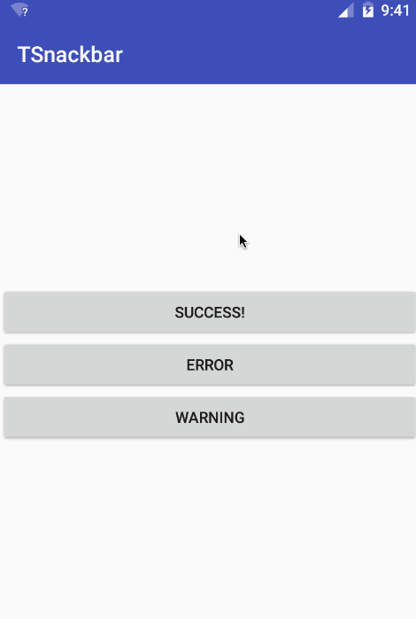
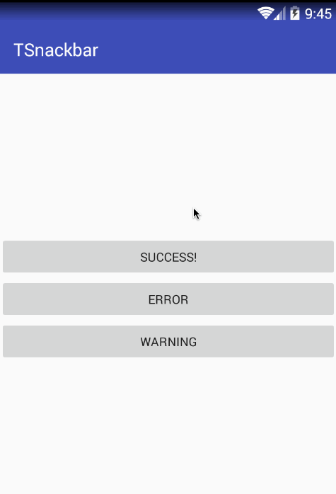
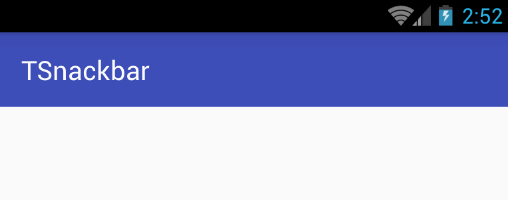

## MySnackBar
从顶部弹出的Snackbar,用于提示用户操作信息.
提供三种信息: SUCCESS,WARNING,ERROR


## 特点
1. 状态栏颜色处理兼容到4.4;在4.4上需要添加values-v19
2. 和Snackbar的调用方法一样,同时支持duration和手势移除,移除时状态栏颜色随手势移除而变化.
3. 提供LUtils用于操作状态栏,支持属性动画

## 使用
```
    if (LUtils.hasKitKat()) {
       // 4.4机器上时设置状态栏颜色
       LUtils.instance(this).setStatusBarColor(getResources().getColor(R.color.colorPrimaryDark));
    }
    
    TSnackbar.make(v, "success", Prompt.SUCCESS).show();//成功
    TSnackbar.make(v, "error", Prompt.ERROR, TSnackbar.LENGTH_LONG).show();//错误
    TSnackbar.make(v, "warning", Prompt.WARNING, 500).show();//警告
    
    //也可以指定某种状态的颜色
    Prompt.SUCCESS.setBackgroundColor(R.color.wanted_color);
    
```

## 注意
   要在主Activity.onDestory()里调用LUtils.clear();避免内存泄露


## ScreenShot
5.0之上<br>

<br>4.4<br>

<br>4.4以下<br>


## Thanks To
<a href="https://github.com/hongyangAndroid/ColorfulStatusBar" target="_blank">ColorfulStatusBar</a>
<br>
<a href="https://github.com/google/iosched" target="_blank">iosched</a>
<a href="https://github.com/baiiu/TSnackbar" target="_blank">TSnackbar</a>

## License

```
Copyright 2015 baiiu

Licensed under the Apache License, Version 2.0 (the "License");
you may not use this file except in compliance with the License.
You may obtain a copy of the License at

   http://www.apache.org/licenses/LICENSE-2.0

Unless required by applicable law or agreed to in writing, software
distributed under the License is distributed on an "AS IS" BASIS,
WITHOUT WARRANTIES OR CONDITIONS OF ANY KIND, either express or implied.
See the License for the specific language governing permissions and
limitations under the License.
```